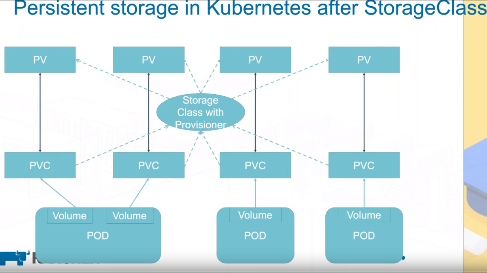
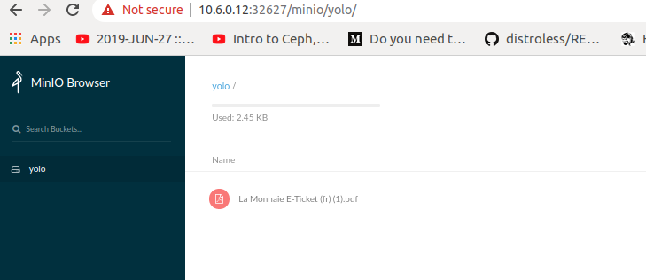

# K3s on TF Grid

## WHY

We want to be able to provision nodes with k3s installed and configured so that we can have a kubernetes cliusyer deployed easily within the grid

## HOW

A special reservation process will setup nodes with the correct binaries of [k3s](https://github.com/rancher/k3s) and with the proper initialisation so that

- We have the necessary kube config to access the cluster from a client. Indeed once k3s setup a k3s.yaml file will be generated on the master node and we need it to configure the cluster on a client machine (usually at ~/.kube/config)

- With kubectl installed on the client machine we can ask for the nodes of our cluster

```
$ kubectl get nodes
NAME        STATUS     ROLES    AGE   VERSION
zv2k8s-03   NotReady   <none>   20d   v1.16.3-k3s.2
zv2k8s-01   Ready      master   20d   v1.16.3-k3s.2
zv2k8s-04   Ready      <none>   20d   v1.16.3-k3s.2
zv2k8s-02   Ready      <none>   20d   v1.16.3-k3s.2
```

at this point we have a master nodes and worker nodes communicationg with each other.

## WHAT

**What do we have so far**

We have been able to deploy several containers including a drupal application connected to a mysql database [ressources files available /ressources/drupal-mysql](/ressources/drupal-mysql) and a wordpress with its mysql server [ressources files available /ressources/wordpress](/ressources/wordpress).

We also have deployed through HELM charts prometheus and grafana monitoring of the cluster

```
$ helm install --namespace mon --name prometheus  stable/prometheus-operator
$ helm list
NAME            NAMESPACE       REVISION        UPDATED                                 STATUS          CHART
        APP VERSION
prometheus      mon             1               2019-12-17 18:13:08.296637106 +0100 CET deployed        prometheus-operator-8.3.3  0.34.0
```

We can deploy

- [x] k8s: Create and Deploy basic resources (Pods, multi container pods, deployment, replicaset, secrets, configmap )
- [x] k8s: Create Services with clusterIP and NodePort
- [x] k8s: Create PV and PVC with local path
- [x] k8s: Create and Deploy prometheus monitoring with helm

- [ ] k8s: Create and Deploy Storage solution (PV, PVC)
  - [x] Rook
  - [x] Rook NFS :boom: need nfs-common
  - [x] Rook CEPH :boom: need rdb module and higher kernel
  - [x] Rook cockroach
  - [x] Rook minio
- [ ] k8s: Create and Deploy Ingress Controllers
- [ ] k8s: Create and Deploy an HA cluster
- [ ] k8s: Create and Deploy cert manager with helm
- [ ] k8s: Create and Deploy applications (CI/CD, multi tier)
- [ ] k8s: Test monitoring
- [ ] k8s: Test logging
- [ ] k8s: Test security
- [ ] k8s: Final report

**What is needed to have a production ready kubernetes cluster**

- networking
  - network policies
  - Test different CNI provider
  - ingress
  - automatic https certifcation with traeffik
- secrets
  - encryption at rest: Kubernetes API encrypts the secrets (optionally, using an external KMS system) before storing them in etcd.
- storage
  - decentralized storage
  - NFS
- high availability setup
  - HA PROXY and metalLB

## Storage

### Local Path k3s storage class

When deploying an application that needs to retain data, you’ll need to create persistent storage. Persistent storage allows you to store application data external from the pod running your application. This storage practice allows you to maintain application data, even if the application’s pod fails.

A persistent volume (PV) is a piece of storage in the Kubernetes cluster, while a persistent volume claim (PVC) is a request for storage.



K3s comes with Rancher’s Local Path Provisioner and this enables the ability to create persistent volume claims out of the box using local storage on the respective node.

let's create a hostPath backed persistent volume claim and a pod to utilize it:

```
cd ressources/storage/simple-localpath/
kubectl create -f pvc.yaml
kubectl create -f pod.yaml
```

### Rook

Rook is an open source cloud-native storage orchestrator, providing the platform, framework, and support for a diverse set of storage solutions to natively integrate with cloud-native environments.

Rook turns storage software into self-managing, self-scaling, and self-healing storage services. It does this by automating deployment, bootstrapping, configuration, provisioning, scaling, upgrading, migration, disaster recovery, monitoring, and resource management. Rook uses the facilities provided by the underlying cloud-native container management, scheduling and orchestration platform to perform its duties.

installing [rook](https://rook.io/docs/rook/v1.2/)

```
git clone --single-branch --branch release-1.2 https://github.com/rook/rook.git
cd cluster/examples/kubernetes/ceph
kubectl create -f common.yaml
kubectl create -f operator.yaml
kubectl create -f cluster-test.yaml
```

### Installing [rook NFS](https://rook.io/docs/rook/v1.2/nfs.html)

NFS allows remote hosts to mount filesystems over a network and interact with those filesystems as though they are mounted locally. This enables system administrators to consolidate resources onto centralized servers on the network.

#### First deploy the Rook NFS operator using the following commands:

```
$ cd resources/storage/rook-NFS
$ kubectl create -f 1-operator.yaml
```

We will create a NFS server instance that exports storage that is backed by the default StorageClass. In k3s environments storageClass "local-path": Only support ReadWriteOnce access mode so for the PVC taht must be created before creating NFS CRD instance.

```
$ kubectl create -f 2-nfs.yaml
$  kubectl get pvc -n rook-nfs
NAME                STATUS   VOLUME                                     CAPACITY   ACCESS MODES   STORAGECLASS   AGE
nfs-default-claim   Bound    pvc-9804c4f1-80e1-45ec-bf05-3dbdd012564e   1Gi        RWO            local-path     3m49s
$ kubectl get po -n rook-nfs
NAME         READY   STATUS    RESTARTS   AGE
rook-nfs-0   1/1     Running   0          16s
```

#### Accessing the Export through dynamic NFS provisioning

Once the NFS Operator and an instance of NFSServer is deployed. A storageclass has to be created to dynamically provisioning volumes.
The StorageClass need to have the following 3 parameters passed.

- exportName: It tells the provisioner which export to use for provisioning the volumes.
- nfsServerName: It is the name of the NFSServer instance.
- nfsServerNamespace: It namespace where the NFSServer instance is running.

```
$ kubectl create -f 3-sc.yaml
```

Once the above storageclass has been created create a PV claim referencing the storageclass as shown in the example given below.

```
$ kubectl create -f 4-pvc.yaml
```

#### Consuming the Export

Now we can consume the PV that we just created by creating an example web server app that uses the above `PersistentVolumeClaim` to claim the exported volume. There are 2 pods that comprise this example:

- A web server pod that will read and display the contents of the NFS share
- A writer pod that will write random data to the NFS share so the website will continually update
  Start both the busybox pod (writer) and the web server from the ressources/storage/rook-NFS folder:

```
kubectl create -f busybox-rc.yaml
kubectl create -f web-rc.yaml
```

CANT CREATE POD SUCK IN CONTAINER CREATING

```
  Warning  FailedMount       15m                   kubelet, zv2k8s-04  Unable to attach or mount volumes: unmounted volumes=[rook-nfs-vol], unattached volumes=[default-token-f6sx2 rook-nfs-vol]: timed out waiting for the condition
  Warning  FailedMount       2m31s (x10 over 16m)  kubelet, zv2k8s-04  MountVolume.SetUp failed for volume "pvc-903d405d-0c9c-4af7-bc2d-356fc03905fb" : mount failed: exit status 255
Mounting command: mount
Mounting arguments: -t nfs 10.43.102.171:/nfs-default-claim /var/lib/kubelet/pods/91d477ac-7e3f-4957-b427-0a3f2a68847b/volumes/kubernetes.io~nfs/pvc-903d405d-0c9c-4af7-bc2d-356fc03905fb
```

probably need nfs-common

### Installing [rook CEPH](https://rook.io/docs/rook/v1.2/ceph.html)

RBD

Rook Ceph requires a Linux kernel built with the RBD module. Many distributions of Linux have this module but some don’t, e.g. the GKE Container-Optimised OS (COS) does not have RBD. You can test your Kubernetes nodes by running modprobe rbd. If it says ‘not found’, you may have to rebuild your kernel or choose a different Linux distribution.

CephFS

If you will be creating volumes from a Ceph shared file system (CephFS), the recommended minimum kernel version is 4.17. If you have a kernel version less than 4.17, the requested PVC sizes will not be enforced. Storage quotas will only be enforced on newer kernels.

No RDB module and kernel < 4.17

```
usr/lib/modules/4.14.82-Zero-OS/kernel/drivers # find /usr/lib/modules | grep rdb
/usr/lib/modules/4.14.82-Zero-OS/kernel/drivers/media/rc/keymaps/rc-avermedia-cardbus.ko
```

### Installing [rook CockroachDB](https://rook.io/docs/rook/v1.2/cockroachdb.html)

**Deploy CockroachDB Operator**
First deploy the Rook CockroachDB operator using the following commands:

```
cd resources/storage/rook-cockroachdb
kubectl create -f operator.yaml
```

You can check if the operator is up and running with:

```
 kubectl -n rook-cockroachdb-system get pod
```

**Create and Initialize CockroachDB Cluster**

```
kubectl create -f cluster.yaml
kubectl -n rook-cockroachdb get clusters.cockroachdb.rook.io
```

To check if all the desired replicas are running, you should see the same number of entries from the following command as the replica count that was specified in cluster.yaml:

```
kubectl -n rook-cockroachdb get pod -l app=rook-cockroachdb
```

**Accessing the Database**
To use the cockroach sql client to connect to the database cluster, run the following command in its entirety:

```
kubectl -n rook-cockroachdb-system exec -it $(kubectl -n rook-cockroachdb-system get pod -l app=rook-cockroachdb-operator -o jsonpath='{.items[0].metadata.name}') -- /cockroach/cockroach sql --insecure --host=cockroachdb-public.rook-cockroachdb
```

This will land you in a prompt where you can begin to run SQL commands directly on the database cluster.

Example:

```
root@cockroachdb-public.rook-cockroachdb:26257/> show databases;
+----------+
| Database |
+----------+
| system   |
| test     |
+----------+
(2 rows)

Time: 2.105065ms
```

**Example App**
If you want to run an example application to exercise your new CockroachDB cluster, there is a load generator application in the same directory as the operator and cluster resource files. The load generator will start writing random key-value pairs to the database cluster, verifying that the cluster is functional and can handle reads and writes.

The rate at which the load generator writes data is configurable, so feel free to tweak the values in loadgen-kv.yaml. Setting --max-rate=0 will enable the load generator to go as fast as it can, putting a large amount of load onto your database cluster.

To run the load generator example app, simply run:

```
kubectl create -f loadgen-kv.yaml
```

You can check on the progress and statistics of the load generator by running:

```
 kubectl -n rook-cockroachdb logs -l app=loadgen
```

To connect to the database and view the data that the load generator has written, run the following command:

```
kubectl -n rook-cockroachdb-system exec -it $(kubectl -n rook-cockroachdb-system get pod -l app=rook-cockroachdb-operator -o jsonpath='{.items[0].metadata.name}') -- /cockroach/cockroach sql --insecure --host=cockroachdb-public.rook-cockroachdb -d test -e 'select * from kv'
```

### Installing [rook minio](https://rook.io/docs/rook/v1.2/minio-object-store.html)

**Deploy Minio Operator**

First deploy the Rook CockroachDB operator using the following commands:

```
cd resources/storage/rook-cockroachdb
kubectl create -f operator.yaml
```

You can check if the operator is up and running with:

```
 kubectl -n rook-cockroachdb-system get pod
```

**Create and Initialize a Distributed Minio Object Store**
Now that the operator is running, we can create an instance of a distributed Minio object store by creating an instance of the objectstore.minio.rook.io resource. Some of that resource’s values are configurable, so feel free to browse object-store.yaml and tweak the settings to your liking.

It is strongly recommended to update the values of accessKey and secretKey in object-store.yaml to a secure key pair, as described in the Minio client quickstart guide.

When you are ready to create a Minio object store, simply run:

```
kubectl create -f object-store.yaml
kubectl -n rook-minio get objectstores.minio.rook.io
kubectl -n rook-minio get pod -l app=minio,objectstore=my-store
```

**Accessing the Object Store**

Minio comes with an embedded web based object browser. In the example, the object store we have created can be exposed external to the cluster at the Kubernetes cluster IP via a “NodePort”. We can see which port has been assigned to the service via:

```
kubectl -n rook-minio get service minio-my-store -o jsonpath='{.spec.ports[0].nodePort}'
```

then navigate to the ip of a node and the port printed with the line above


